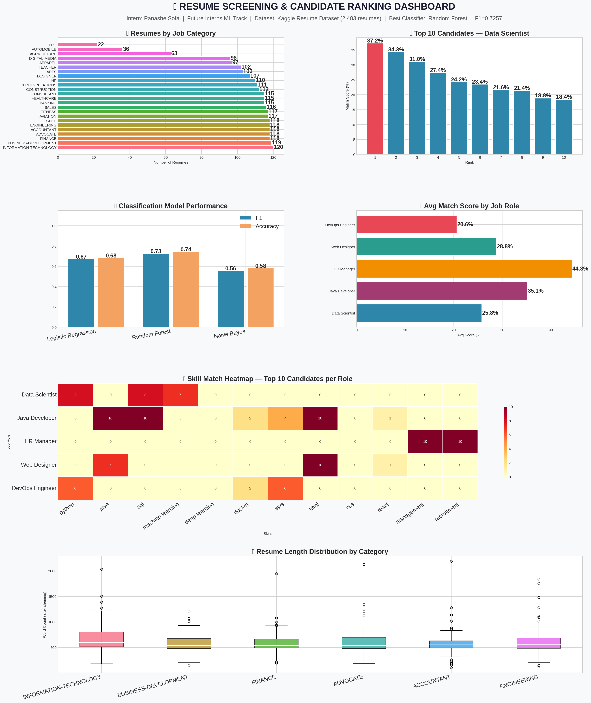
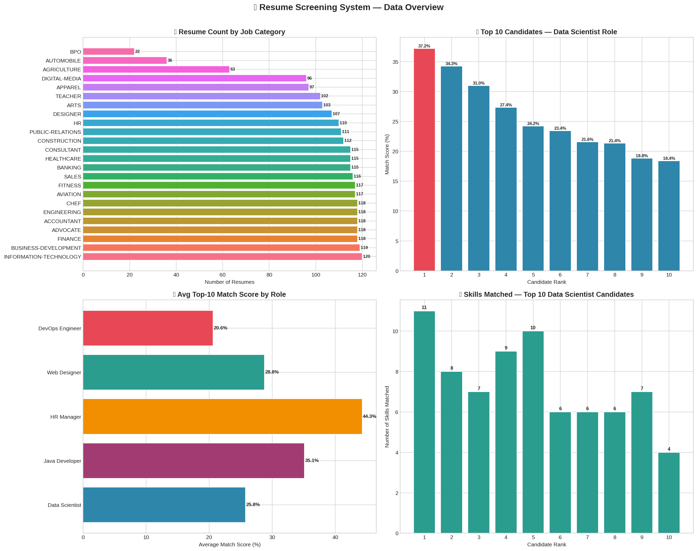
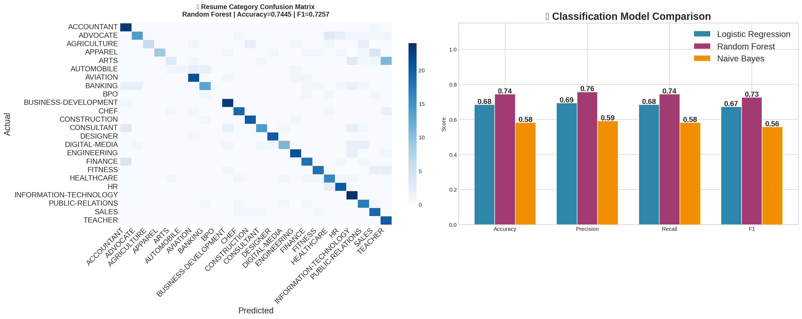
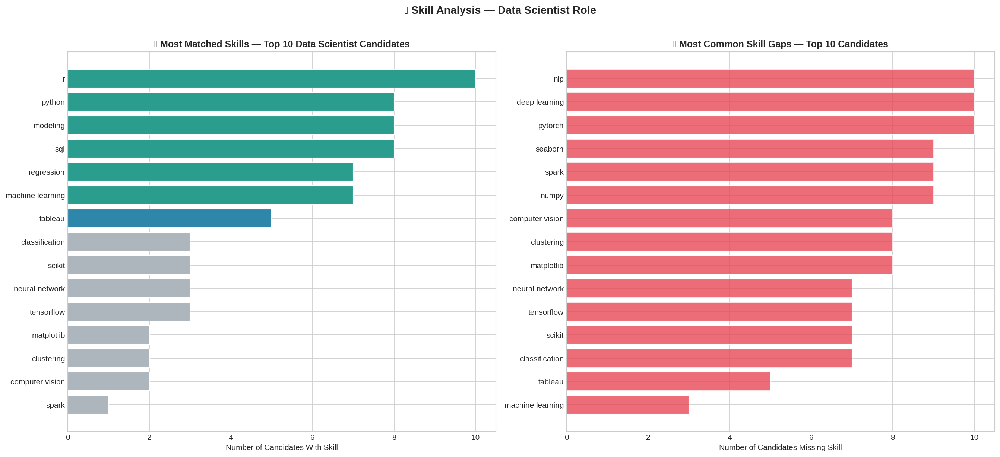
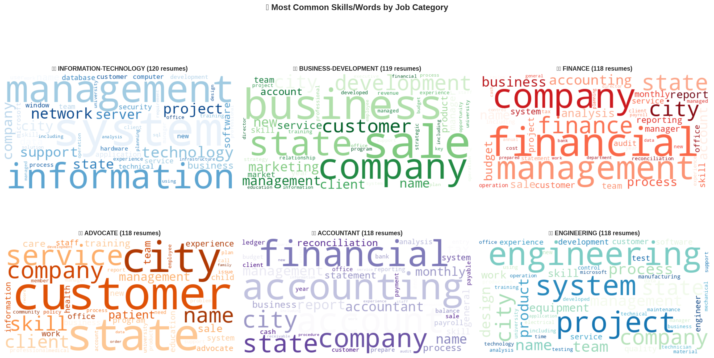

# 📄 Resume / Candidate Screening System
### Machine Learning Internship — Future Interns | Task 3


---

## 📌 Project Overview

This project builds an **ML-powered resume screening and candidate ranking system** for a recruitment platform. The system automatically reads resume text, extracts relevant skills, scores each candidate against a job description using TF-IDF cosine similarity, and ranks them by role fit — helping recruiters shortlist top candidates in seconds instead of hours.

> Built as part of the **Future Interns Machine Learning Fellowship Program**
> **Intern:** Panashe Sofa | **CIN:** FIT/FEB26/ML5773

---

## 🎯 Objectives

- Clean and preprocess 2,484 real resume texts using NLP
- Extract technical and soft skills using a curated skills database
- Score resumes against 5 job descriptions using TF-IDF cosine similarity
- Rank candidates by combined match score (TF-IDF + skill match)
- Identify skill gaps per candidate
- Classify resumes into 24 job categories using ML models
- Present results in a professional business dashboard

---

## 📊 Key Results

### Resume Category Classification (24 categories)

| Model | Accuracy | F1 Score |
|---|---|---|
| **Random Forest** ⭐ | **74.45%** | **0.7257** |
| Logistic Regression | 68.41% | 0.6722 |
| Naive Bayes | 58.15% | 0.5575 |

### Screening Performance
| Metric | Value |
|---|---|
| Total Resumes Screened | 2,484 |
| Job Roles Supported | 5 |
| Skills in Database | 70+ |
| Processing Time | < 5 seconds |

---

## 🏢 Business Context

This system was built for a **recruitment platform / HR-tech startup** that handles high-volume hiring for technical roles. The platform receives hundreds of resumes per job posting and needed an automated way to:

- Shortlist the top candidates without manual reading
- Route resumes to the correct hiring team by category
- Show recruiters exactly which skills each candidate has and lacks
- Reduce time-to-hire from weeks to hours

The 5 job roles supported are: **Data Scientist, Java Developer, HR Manager, Web Designer, and DevOps Engineer** — covering the most common high-volume hiring categories in the tech industry.

---

## 🔍 How the Scoring Works

```
Resume Text (PDF/Text)
        ↓
Text Cleaning (remove URLs, emails, symbols, lemmatize)
        ↓
Skill Extraction (match against 70+ skill keywords)
        ↓
TF-IDF Vectorization (10,000 features, bigrams)
        ↓
Cosine Similarity vs Job Description
        ↓
┌─────────────────────┐    ┌──────────────────────┐
│ TF-IDF Score (70%)  │ +  │ Skill Match Score(30%)│
└─────────────────────┘    └──────────────────────┘
        ↓
Final Match Score (%) → Ranked Candidate List
        ↓
Skill Gap Report (what's missing per candidate)
```

### Scoring Formula
```
Final Score = 0.70 × TF-IDF Cosine Similarity
            + 0.30 × (Matched Skills / Total JD Skills)
```

---

## 📈 Visualizations

### Full Dashboard


### Resume Overview


### Classification Results


### Skill Gap Analysis


### Word Clouds by Category


---

## 💡 Business Impact

| Problem | Solution | Impact |
|---|---|---|
| Reading 500 resumes takes 2+ days | System ranks all in seconds | Saves 90% of screening time |
| Inconsistent manual scoring | Objective ML-based scoring | Fair, repeatable hiring decisions |
| Wrong candidates shortlisted | Skill-matched ranking | Higher quality shortlists |
| No visibility on skill gaps | Per-candidate gap report | Better interview preparation |
| Resumes go to wrong team | Auto-category classification | Correct routing every time |

---

## 🏷️ The 5 Job Roles Supported

| Role | Key Skills Required |
|---|---|
| Data Scientist | Python, ML, TensorFlow, SQL, Statistics, Pandas |
| Java Developer | Java, Spring Boot, REST API, Docker, Microservices |
| HR Manager | Recruitment, Payroll, HRIS, Compliance, Training |
| Web Designer | HTML, CSS, React, Figma, UI/UX, JavaScript |
| DevOps Engineer | Docker, Kubernetes, AWS, Jenkins, CI/CD, Terraform |

---

## ⚙️ NLP Pipeline — Text Preprocessing

| Step | What It Does | Example |
|---|---|---|
| Remove URLs | Clean web links | "www.github.com" → removed |
| Remove emails | Strip contact info | "john@email.com" → removed |
| Remove numbers | Eliminate noise | "2019–2023" → removed |
| Lowercase | Normalise text | "Python" → "python" |
| Stopword removal | Remove common words | "I worked at" → "worked" |
| Lemmatization | Root word form | "developing" → "develop" |
| TF-IDF | Convert to numbers | "machine learning" → 0.342 |

---

## 🗂️ Project Structure

```
FUTURE_ML_03/
│
├── data/
│   └── resume.csv                  ← Kaggle Resume Dataset
│
├── Resume_Screening.ipynb          ← Main Jupyter Notebook
│
├── resume_dashboard.png            ← Full business dashboard
├── resume_overview.png             ← Data exploration charts
├── classification_results.png      ← Model comparison chart
├── skill_analysis.png              ← Skill gap analysis
├── word_clouds.png                 ← Word clouds by category
│
└── README.md                       ← This file
```

---

## 🛠️ Technologies Used

| Tool | Purpose |
|---|---|
| Python 3.9 | Core programming language |
| NLTK | Tokenization, stopword removal, lemmatization |
| Scikit-learn | TF-IDF, cosine similarity, ML classifiers |
| Pandas | Data manipulation and analysis |
| Matplotlib / Seaborn | Visualizations and dashboard |
| WordCloud | Skill/word frequency visualization |
| Jupyter Notebook | Development environment |

---

## 📦 Dataset

**Resume Dataset (Kaggle)**
- Source: [Kaggle — snehaanbhawal](https://www.kaggle.com/datasets/snehaanbhawal/resume-dataset)
- Records: 2,484 resumes
- Categories: 24 job categories
- Format: Text-based resume content
- Fields: ID, Resume_str, Resume_html, Category

---

## 🚀 How to Run

```bash
# 1. Clone the repository
git clone https://github.com/PanasheSofa/FUTURE_ML_03.git
cd FUTURE_ML_03

# 2. Install dependencies
pip install pandas numpy matplotlib seaborn scikit-learn nltk wordcloud

# 3. Place resume.csv in the data/ folder

# 4. Launch Jupyter Notebook
jupyter notebook

# 5. Open Resume_Screening.ipynb and run all cells top to bottom
```

---

## 👤 Author

**Panashe Sofa**
Machine Learning Intern — Future Interns Fellowship
CIN: FIT/FEB26/ML5773
🔗 [GitHub Profile](https://github.com/PanasheSofa)

---

*Completed as part of the Future Interns ML Internship Program (Feb–Mar 2026)*
*Dataset: Kaggle Resume Dataset*
